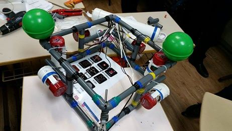

## Engineering-2015-Seagle

 

This is the container for all the works of Seagle. Seagle is a collaborative effort of the whole AIS Engineering Club - ROV Team in 2015.

 

**A picture of the ROV**:

 

**Technical Report**:

[Seagle Technical Report](Report/report.pdf)

 

**Company Specification Sheet**:

[Specification Sheet](Report/Resources/specification_sheet.pdf)

 

**ROV System Integration Diagram**:

[System integration diagram](Report/Resources/system_integrated_diagram.pdf)
