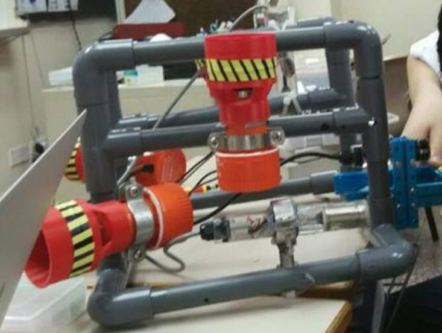
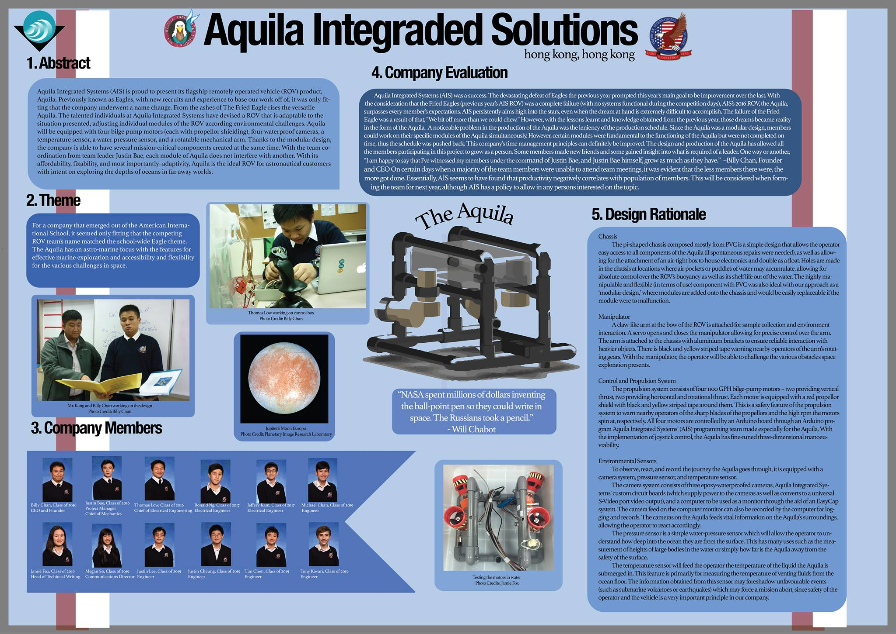
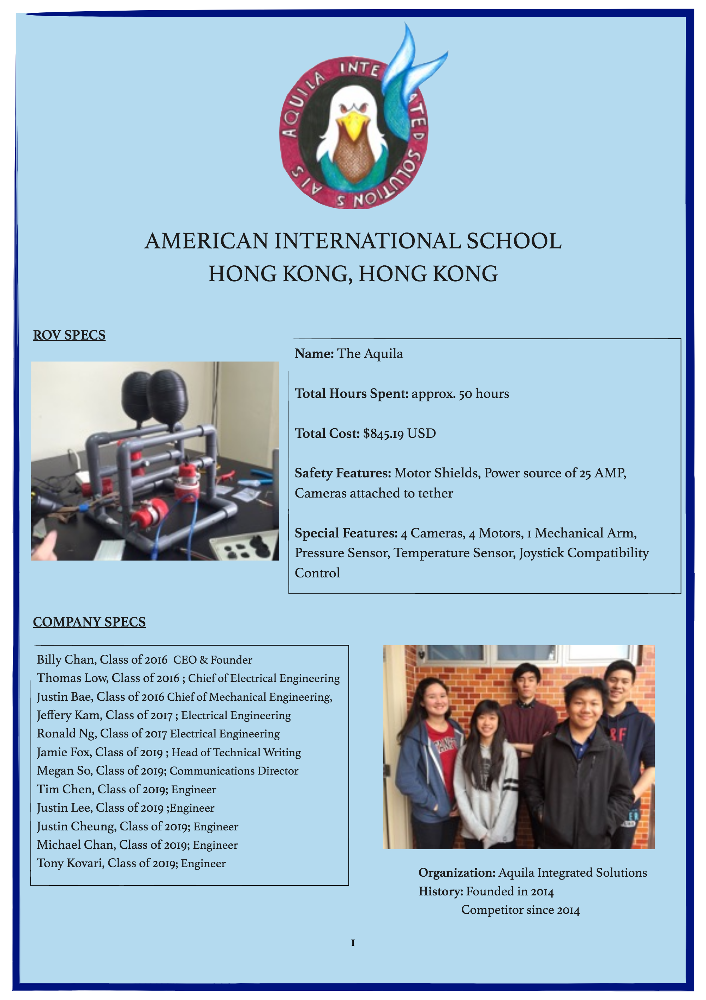
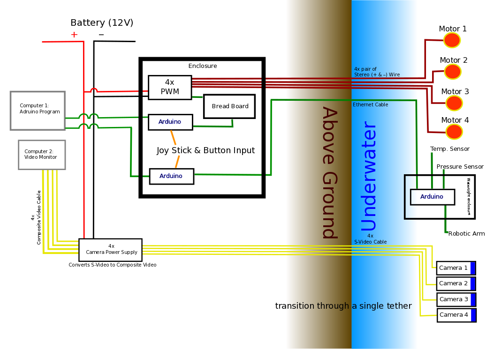

# Engineering-2016-Aquila-I

 

This is the container for all the works of Aquila. Aquila is a collaborative effort of the whole AIS Engineering Club - ROV Team in 2016.

 

**A picture of the ROV**:

 

**Technical Report**:

[Aquila I Technical Report](Report/report.pdf)

 

**Poster**:

 

**Company Specification Sheet**:

 

**ROV System Integration Diagram**:

