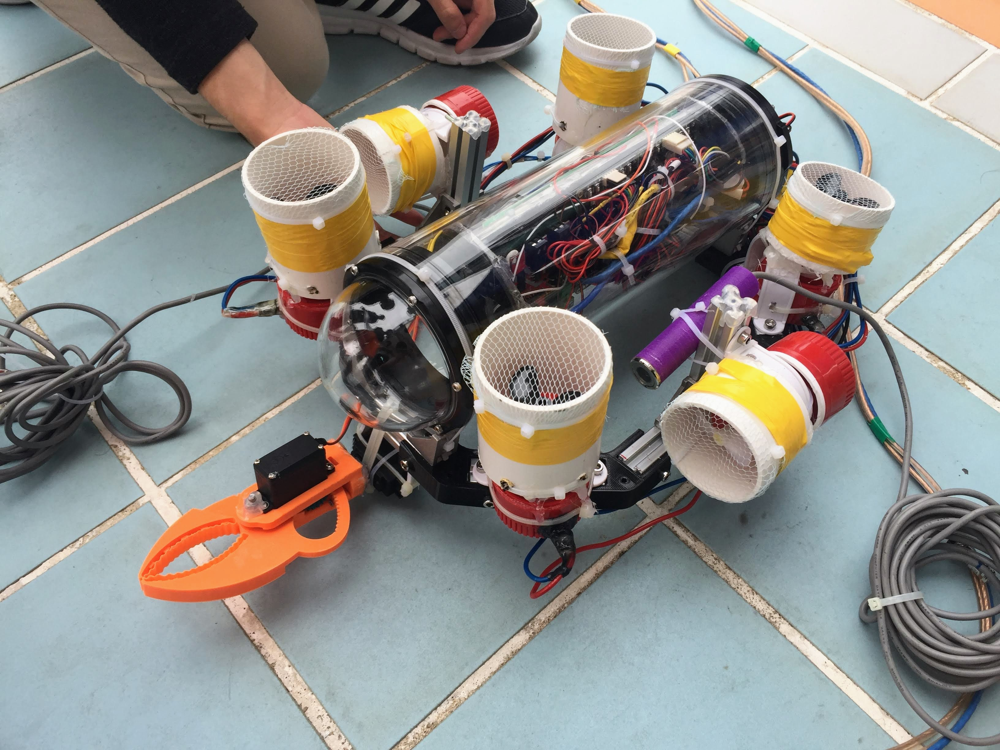
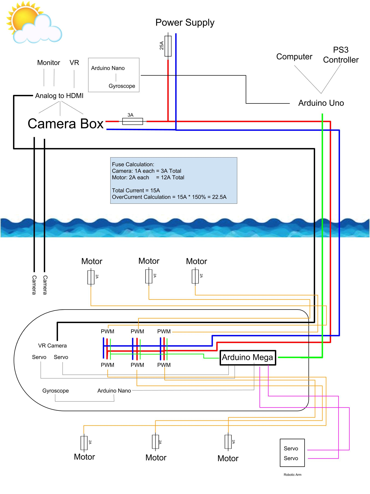

## Engineering-2017-Aquila-II

 

This is the container for all the works of Aquila II. Aquilla II is a collaborative effort of the whole AIS Engineering Club - ROV Team in 2017.

 

**A picture of the ROV**:

 

**Technical Report**:

[Aquila II Technical Report](Report/report.pdf)

 

**Company Specification Sheet**:

[Specification Sheet](Report/Resources/specfication_sheet.png)

 

**ROV System Integration Diagram**:

